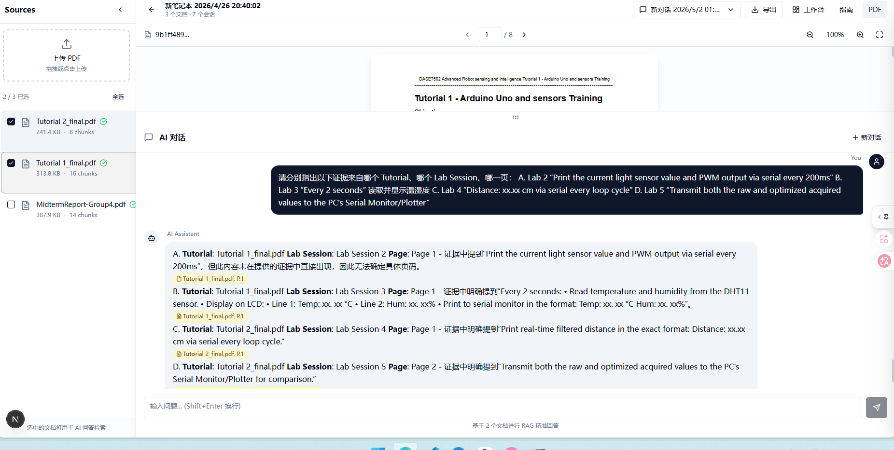

# NotebookMind

企业级多文档智能问答平台，支持 PDF 解析、混合检索、意图识别、SSE 流式响应、视觉问答 (VQA) 和 AI 反思。



## 项目结构

```
enterprise-pdf-ai/
├── cmd/
│   ├── api/              # API 服务入口
│   └── worker/           # 异步 Worker 入口
├── internal/
│   ├── api/
│   │   ├── handlers/     # HTTP 处理器 (Auth, Document, Chat, Search, Note, Dashboard, VQA)
│   │   ├── middleware/   # JWT 认证、日志、限流、CORS
│   │   └── router/       # Gin 路由配置
│   ├── app/              # 依赖注入容器
│   ├── models/           # 数据模型 (User, Document, ChatSession, Note 等)
│   ├── parser/           # 结构化文档解析器 (Phase 1: PDF/OCR/表格/VLM/父子块)
│   │   ├── types.go          # 核心类型定义（BlockType/Chunk/TableData/BoundingBox）
│   │   ├── service.go        # ParserService 接口 + OCRProvider/VLMProvider 接口
│   │   ├── pdf_parser.go     # PDF 文本提取、标题检测、表格解析、OCR 触发
│   │   ├── ocr_provider.go   # RapidOCR 集成 + 降级 OCR
│   │   ├── vlm_provider.go   # OpenAI Vision VLM 图片描述生成 + 降级
│   │   ├── chunk_builder.go  # 父子块构建策略（Child 召回 / Parent 上下文）
│   │   └── document_parser.go# 主编排器：串联解析→分块全流程
│   ├── observability/    # 结构化日志与质量指标 (logging.go)
│   ├── repository/       # 数据访问层 (PostgreSQL, Redis, Milvus)
│   ├── service/          # 业务逻辑层
│   └── worker/           # Asynq 异步任务处理器
├── configs/              # 配置文件 (YAML，含 parser/ocr/vlm 配置节)
├── web/                  # Next.js 16 前端（独立文档 → [web/README.md](web/README.md)）
├── scripts/              # 脚本工具 (test_notebook.ps1, notebook_eval.py)
├── tests/                # 测试文件
│   └── data/             # 离线评测数据集 (eval_dataset.jsonl)
├── docs/                 # 项目文档
│   ├── API.md            # OpenAPI 接口文档
│   └── api_notebooklm.md # NotebookLM 风格接口文档
├── docker-compose.yaml   # PostgreSQL + Redis
├── .env.example          # 环境变量模板（含 Parser/OCR/VLM 配置）
└── go.mod / go.sum       # Go 模块依赖
```

> **前端架构与功能说明请参阅 [web/README.md](web/README.md)**

---

## 后端核心能力

### 1. 结构化文档解析层（Phase 1）
- **PDF 文档理解**：从"纯文本抽取+字符分块"升级为结构化文档理解
- **标题层级检测**：自动识别 H1-H6 标题，构建文档路径 (section_path)
- **表格结构化**：自动检测表格行列、表头单元格，生成 HTML + 纯文本双格式
- **OCR 扫描件支持**：RapidOCR 集成，文本密度低于阈值时自动触发 OCR（可配置降级）
- **VLM 图片描述**：OpenAI Vision API 为图片块生成语义描述（可选，无配置时降级跳过）
- **父子块策略**：
  - **Child 块**（~300 字符）：用于向量召回，提高检索精准度
  - **Parent 块**（~1000 字符）：用于回答上下文拼接，保证信息完整性
- **元数据标准化**：每块携带 `document_id` / `page` / `chunk_type` / `bbox` / `section_path`
- **降级保障**：Parser 服务不可用时自动降级到旧的纯文本提取逻辑

### 2. 检索增强层
- **混合检索**：Dense (向量) + Sparse (BM25) 混合，权重可配
- **意图识别**：6 种类型 (factual, summary, comparison, analysis, definition, procedure)
- **查询改写**：结合历史会话提取上下文术语

### 3. 智能体工作流
- **SSE 流式问答**：实时流式输出，支持 8 种事件类型
- **Map-Reduce 并发**：Goroutines 并发总结多文档
- **研究笔记**：创建/更新/删除/钉住/标签管理/按标签搜索
- **AI 反思**：对回答进行准确性、完整性、来源覆盖度分析

### 4. 视觉问答 (VQA)
- **图片上传问答**：上传图片进行问答
- **图片 URL 问答**：通过 URL 获取图片进行问答
- **图文增强问答**：结合文档上下文和图片进行问答

### 5. 企业安全
- **多租户隔离**：Milvus Partition Key 逻辑隔离
- **租户服务**：`TenantIsolation` 接口设计

---

## 后端技术栈

| 层级 | 技术 |
|------|------|
| 语言 | Go 1.22+ |
| Web 框架 | Gin |
| ORM | GORM |
| 数据库 | PostgreSQL |
| 缓存 | Redis |
| 向量库 | Milvus / Zilliz Cloud（可选，降级为 PostgreSQL 本地向量） |
| 异步任务 | Asynq + Redis |
| AI | OpenAI |
| 配置管理 | Viper (YAML) |

---

## 快速开始

### 前置要求

- Go 1.22+
- Node.js 18+ / npm（仅前端开发需要）
- Docker & Docker Compose（PostgreSQL + Redis）

### 1. 启动基础依赖

```powershell
docker compose up -d
```

端口：
- PostgreSQL: `localhost:5432`
- Redis: `localhost:6379`

### 2. 配置环境变量

```powershell
Copy-Item .env.example .env
```

必须填写：
- `OPENAI_API_KEY` — OpenAI API 密钥
- `JWT_SECRET` — JWT 签名密钥

可选（本地开发可留空）：
- `MILVUS_ADDRESS` / `MILVUS_PASSWORD` — 留空则使用 PostgreSQL 本地向量存储

### 3. 启动后端服务

```powershell
# 终端 1: 启动 Worker（异步任务处理）
go run ./cmd/worker

# 终端 2: 启动 API 服务
go run ./cmd/api
```

服务地址：
- API: `http://localhost:8080`
- Base Path: `http://localhost:8080/api/v1`

### 4. 启动前端（可选）

> 详细前端说明见 [web/README.md](web/README.md)

```powershell
cd web
npm install
npm run dev
```

前端地址：`http://localhost:3000`

---

## API 接口

> 完整 API 文档请参阅 [API.md](docs/API.md) 和 [api_notebooklm.md](docs/api_notebooklm.md)

### 认证
| 方法 | 路径 | 说明 |
|------|------|------|
| POST | `/api/v1/auth/register` | 注册 |
| POST | `/api/v1/auth/login` | 登录 |
| GET | `/api/v1/me` | 当前用户信息 |

### 笔记本 (NotebookLM)
| 方法 | 路径 | 说明 |
|------|------|------|
| GET | `/api/v1/notebooks` | 笔记本列表 |
| POST | `/api/v1/notebooks` | 创建笔记本 |
| GET | `/api/v1/notebooks/:id` | 笔记本详情 |
| PUT | `/api/v1/notebooks/:id` | 更新笔记本 |
| DELETE | `/api/v1/notebooks/:id` | 删除笔记本 |

### 文档管理
| 方法 | 路径 | 说明 |
|------|------|------|
| POST | `/api/v1/notebooks/:id/documents` | 上传并添加文档 |
| DELETE | `/api/v1/notebooks/:id/documents/:docId` | 移除文档 |
| GET | `/api/v1/notebooks/:id/documents` | 文档列表 |
| GET | `/api/v1/notebooks/:id/documents/:docId/guide` | 文档指南（结构化摘要） |

### 会话 (Chat) — SSE 流式问答
| 方法 | 路径 | 说明 |
|------|------|------|
| GET | `/api/v1/notebooks/:id/sessions` | 会话列表 |
| POST | `/api/v1/notebooks/:id/sessions` | 创建会话 |
| DELETE | `/api/v1/notebooks/:id/sessions/:sessionId` | 删除会话（级联删除消息） |
| GET | `/api/v1/chat/sessions/:sessionId/messages` | 历史消息 |
| POST | `/api/v1/notebooks/:id/sessions/:sessionId/chat` | **SSE 流式问答** |

### 搜索
| 方法 | 路径 | 说明 |
|------|------|------|
| POST | `/api/v1/notebooks/:id/search` | 笔记本内语义搜索 |
| GET | `/api/v1/search` | 全局跨笔记本搜索 |

### 研究笔记
| 方法 | 路径 | 说明 |
|------|------|------|
| GET | `/api/v1/notes` | 笔记列表（含 total_count） |
| POST | `/api/v1/notes` | 创建笔记 |
| PUT | `/api/v1/notes/:id` | 更新笔记 |
| DELETE | `/api/v1/notes/:id` | 删除笔记 |
| PUT | `/api/v1/notes/:id/pin` | 钉住/取消钉住 |
| POST | `/api/v1/notes/:id/tags` | 添加标签 |
| DELETE | `/api/v1/notes/:id/tags/:tag` | 移除标签 |
| GET | `/api/v1/notes/tags/search?tag=...` | 按标签搜索 |

### VQA 视觉问答
| 方法 | 路径 | 说明 |
|------|------|------|
| POST | `/api/v1/chat/vqa/upload` | 图片上传问答 |
| POST | `/api/v1/chat/vqa/url` | 图片 URL 问答 |
| POST | `/api/v1/chat/vqa/enhanced` | 图文增强问答 |

---

## 测试

### 功能测试（API 集成测试）

```powershell
# 确保 API 服务已启动，然后运行测试脚本
.\scripts\test_notebook.ps1 -ApiBase "http://localhost:8080/api/v1"
```

测试覆盖：认证、文档管理、聊天会话、SSE 流式问答、推荐问题、AI 反思、VQA 视觉问答、语义搜索、笔记管理。

### 单元测试

```powershell
go test ./internal/api/handlers
go test ./internal/service
go test ./internal/repository
go test ./internal/worker
```

### 离线评估（LLM-as-a-Judge）

使用 LLM-as-a-Judge 方法自动评估问答质量：

```powershell
# 基础运行（需先启动 API 服务）
python scripts/notebook_eval.py --api-base http://localhost:8080/api/v1

# 使用 GPT-4o 作为 Judge，输出详细报告
$env:OPENAI_API_KEY="sk-your-key"
python scripts/notebook_eval.py --judge-model gpt-4o -o eval_report.json

# 只测 API 可用性和延迟（跳过 Judge 评估）
python scripts/notebook_eval.py --no-judge
```

**评测维度：**
| 指标 | 说明 | 范围 |
|------|------|------|
| Groundedness | 忠实度/基于上下文程度 | [0-5] |
| Relevance | 相关性/是否针对问题 | [0-5] |
| Completeness | 完整性/覆盖面 | [0-5] |
| Citation Precision | 引用精确度 | [0-1] |
| Hallucination Rate | 幻觉率 | 百分比 |
| Recall@K | 检索召回率 | [0-1] |

**在线指标采集（结构化日志）：**

系统通过 `go.uber.org/zap` 在关键链路注入结构化埋点，自动采集：
- **延迟指标**：总耗时、检索耗时、LLM 调用耗时、P95 延迟
- **Token 用量**：Prompt Tokens、Completion Tokens、Total Tokens
- **检索质量**：检索到的 Chunk 数量、来源文档 ID 列表
- **错误追踪**：错误类型、错误信息、失败阶段

日志事件类型：
- `chat_request`: 完整聊天请求指标
- `retrieval`: 检索详情
- `llm_call`: LLM 调用记录 (generate/embed/reflection)
- `document_processing`: 文档处理各阶段耗时

---

## 后端项目结构详解

```
cmd/
├── api/main.go           # API 服务入口，初始化 Router、Middleware、Handlers
└── worker/main.go        # Worker 服务入口，注册 Asynq 任务处理器

internal/
├── api/
│   ├── handlers/         # 各业务模块的 HTTP 处理器
│   │   ├── auth.go       #   注册/登录/JWT 签发
│   │   ├── document.go   #   文档上传/列表/移除/指南生成
│   │   ├── chat.go       #   SSE 流式问答/消息历史/推荐问题/AI反思
│   │   ├── search.go     #   笔记本搜索/全局搜索
│   │   ├── note.go       #   研究笔记 CRUD/标签/钉住
│   │   ├── dashboard.go  #   使用统计面板数据
│   │   └── vqa.go        #   视觉问答（图片上传/URL/图文增强）
│   ├── middleware/
│   │   ├── auth.go       #   JWT 认证中间件
│   │   ├── logger.go     #   请求日志中间件
│   │   ├── ratelimit.go  #   限流中间件
│   │   └── cors.go       #   CORS 跨域中间件
│   └── router/
│       └── router.go     #   Gin 路由注册与分组
├── app/
│   └── container.go      # 依赖注入容器（含 ParserService 初始化）
├── parser/               # ★ Phase 1: 结构化文档解析模块 ★
│   ├── types.go          #   核心类型 (BlockType/Chunk/TableData/BoundingBox)
│   ├── service.go        #   ParserService/OCRProvider/VLMProvider 接口
│   ├── pdf_parser.go     #   PDF 解析器 (标题检测/表格解析/OCR触发)
│   ├── ocr_provider.go   #   RapidOCR 集成 + 降级 OCR
│   ├── vlm_provider.go   #   OpenAI Vision VLM + 降级
│   ├── chunk_builder.go  #   父子块构建策略
│   └── document_parser.go#   主编排器
├── models/               # GORM 数据模型定义
│   ├── user.go           #   用户模型
│   ├── notebook.go       #   笔记本模型
│   ├── document.go       #   文档模型
│   ├── chat_session.go   #   聊天会话模型
│   ├── chat_message.go   #   聊天消息模型
│   └── note.go           #   研究笔记模型
├── repository/           # 数据访问层
│   ├── postgres/         #   PostgreSQL 实现
│   ├── redis/            #   Redis 缓存层
│   └── milvus/           #   Milvus 向量检索层
├── service/              # 业务逻辑层
│   ├── auth_service.go   #   认证服务
│   ├── document_service.go #   文档解析与处理服务
│   ├── chat_service.go   #   聊天/RAG/意图识别服务
│   ├── search_service.go #   检索服务（混合检索）
│   ├── note_service.go   #   笔记管理服务
│   └── vqa_service.go    #   VQA 视觉问答服务
└── worker/               # Asynq 异步任务
    ├── processor.go      #   文档处理主流程 (Parser → Chunk → Index → Guide)
    └── tasks/            #   任务类型定义
```

---

## 开发说明

### 环境变量

敏感信息通过 `.env` 配置（已加入 `.gitignore`），使用 `.env.example` 作为模板。

主要环境变量：

| 变量 | 说明 | 必填 |
|------|------|------|
| `OPENAI_API_KEY` | OpenAI API Key | 是 |
| `JWT_SECRET` | JWT 签名密钥 | 是 |
| `DATABASE_URL` | PostgreSQL 连接串 | 否（有默认值） |
| `REDIS_URL` | Redis 连接地址 | 否（有默认值） |
| `MILVUS_ADDRESS` | Milvus 地址 | 否（留空用 PG 本地向量） |
| `MILVUS_PASSWORD` | Milvus 密码 | 否 |
| `SERVER_PORT` | API 服务端口 | 否（默认 8080） |
| **Parser 解析配置** | | |
| `PARSER_CHUNK_SIZE` | 父块最大字符数 (默认 1000) | 否 |
| `PARSER_CHILD_CHUNK_SIZE` | 子块最大字符数 (默认 300) | 否 |
| **OCR 配置** | | |
| `OCR_PROVIDER` | OCR 服务类型：`rapidocr` / `fallback` (默认) | 否 |
| `OCR_BASE_URL` | RapidOCR 服务地址 | 否 |
| **VLM 图片描述配置** | | |
| `VLM_ENABLED` | 启用 VLM 图片描述生成 | 否 |
| `VLM_API_KEY` | VLM API Key (默认复用 OPENAI_API_KEY) | 否 |
| `VLM_MODEL` | VLM 模型名称 (默认 gpt-4o-mini) | 否 |

### 数据库迁移

PostgreSQL 表结构由 GORM AutoMigrate 自动管理，首次启动时自动创建所需表。

### 配置文件

后端使用 `configs/` 目录下的 YAML 配置文件（通过 Viper 加载），支持不同环境配置。

---

