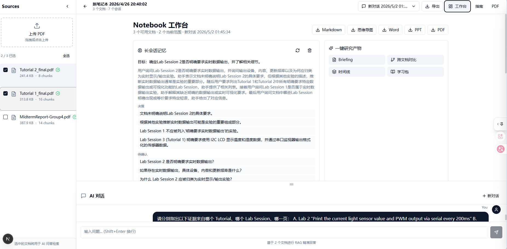
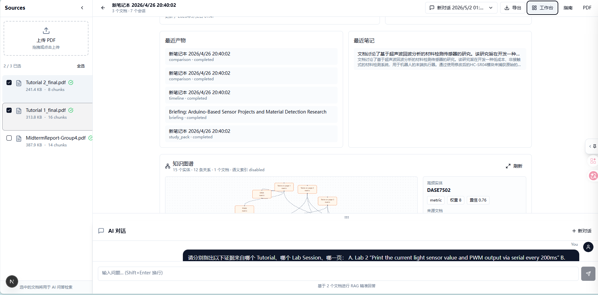
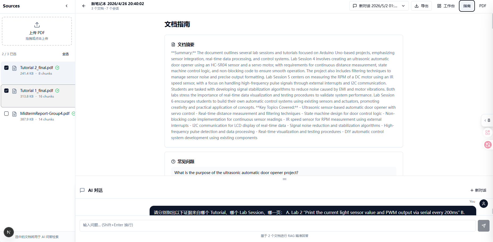
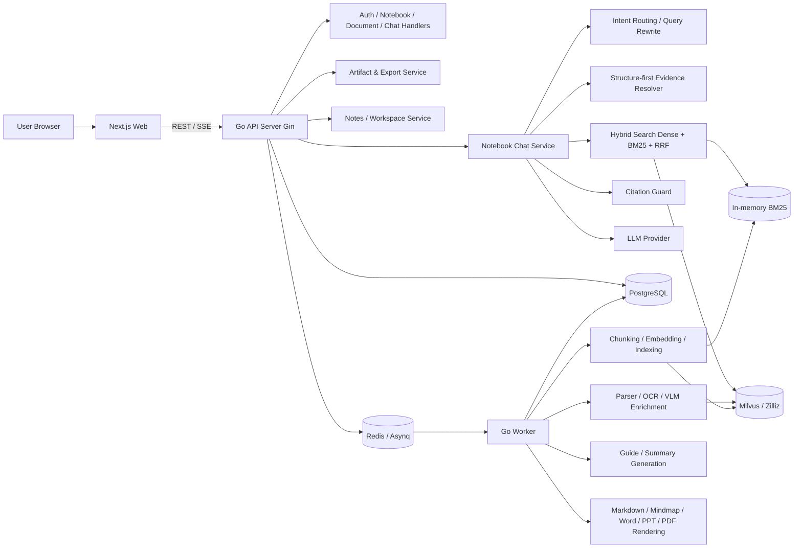
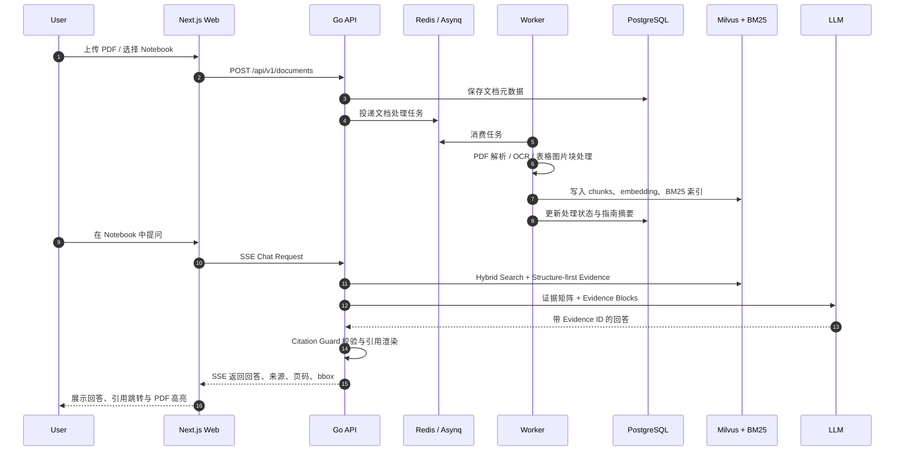
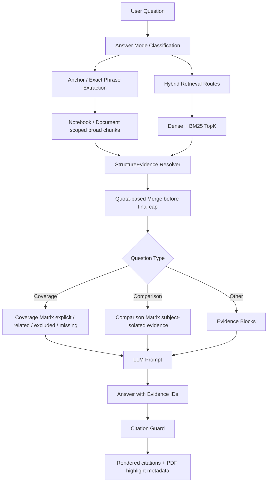

# NotebookMind

NotebookMind 是一个类 NotebookLM 的文档研究工作台。项目支持 PDF 上传解析、Notebook 级多文档问答、引用溯源、PDF 高亮、研究笔记、研究产物生成，以及 Markdown / 思维导图 / Word / PPT / PDF 导出。

本项目的目的不是做一个普通聊天机器人，而是让用户围绕一组文档完成持续研究：上传资料、提问、追溯来源、整理笔记、生成 briefing / FAQ / 时间线 / 学习材料和可编辑导出物。

## 功能特性

- **文档理解**：PDF 解析、OCR 降级、表格/图片/图表块识别、页码与 bbox 元数据保留。
- **Notebook RAG 问答**：Dense + BM25 Hybrid Search、RRF 融合、可选 Cohere Rerank、低置信度 failover。
- **可信回答**：答案段落绑定证据 ID，后端 Citation Guard 校验引用覆盖和数字支持；覆盖型/对比型问题额外使用结构化证据矩阵降低漏召回和证据串台。
- **多模态证据层**：图片/图表区域可持久化为 visual evidence，VLM 可选生成结构化图表 JSON，视觉问题会优先提升图像/图表证据。
- **研究工作流**：Notebook 级 briefing、对比、时间线、主题聚类、学习材料、FAQ、关键洞察。
- **长会话记忆**：按会话自动压缩研究目标、结论、待确认问题和回答偏好，作为低优先级上下文注入问答。
- **Artifact 导出**：支持 Markdown、Mermaid 思维导图、Word、PPT、PDF；采用“生成大纲 -> 用户确认 -> 异步渲染 -> 下载”的闭环。
- **前端体验**：Next.js Notebook 页面、工作台视图、SSE 流式聊天、来源列表、PDF 跳转与高亮、导出弹窗与任务进度。
- **评测体系**：JSONL 离线评测集与 `scripts/notebook_eval.py`，覆盖事实问答、表格、多文档、多轮、图文问答和幻觉检测。




## 当前效果

当前默认链路采用“Hybrid RAG + Structure-first Evidence + Citation Guard + 多轮上下文增强”的轻量可信问答方案。它保留普通语义检索的灵活性，同时针对覆盖型列举、结构项查询、跨文档/跨章节对比做了额外的证据约束：

- **结构优先证据**：对用户明确提到的章节、表格、Requirement、Lab Session 等 anchor 做优先召回，并补充同 section / 相邻 chunk 上下文。
- **覆盖型问题增强**：不只依赖 TopK，而是从 notebook/document scoped chunks 做较宽候选扫描，再用 Coverage Matrix 区分 `explicit / related / excluded / missing`。
- **对比题隔离**：Comparison Matrix 按 subject 分桶，要求每个表格单元只使用本 subject 的证据，减少“把 A 的难点套到 B 上”的问题。
- **引用可信化**：生成阶段只输出证据 ID，后端统一渲染文档与页码引用；PDF 预览支持页码跳转和 bbox 高亮。
- **可回滚配置**：`structure_evidence.enabled` 可关闭结构化证据层，便于本地排查或评测对比。

最近一次代码层验证：

```bash
go test ./...
cd web && npm run build
```

说明：离线评测结果依赖本地数据集、模型、API 配置和当次 LLM-as-Judge 输出。Phase 3 的全量 Planner -> Reason -> Verify 主链路已验证不适合作为默认路径，目前默认采用更轻量的 Citation Guard 与结构化证据层。

## 技术栈

| 层级 | 技术 |
| --- | --- |
| 后端 API | Go、Gin、GORM |
| 异步任务 | Asynq、Redis |
| 数据库 | PostgreSQL |
| 向量检索 | Milvus / Zilliz，BM25 内存索引 |
| 文档解析 | Go PDF parser、结构化 chunk builder、可选 OCR / VLM |
| LLM | OpenAI 兼容接口，支持 OpenAI / Anthropic / Gemini / Custom |
| 前端 | Next.js、React、TypeScript、Tailwind CSS |
| 导出渲染 | Python sidecar，Markdown / Mermaid / docx / pptx / PDF |
| 评测 | Python JSONL evaluator，LLM-as-a-Judge |

## 架构概览



### 标准处理流程



### 问答证据流程



## 快速启动

### 1. 准备环境

需要安装：

- Go 1.25+
- Node.js 20+
- Python 3.10+
- Docker Desktop

复制环境变量模板：

```bash
cp .env.example .env
```

至少配置：

```env
JWT_SECRET=your-secret
OPENAI_API_KEY=your-api-key
```

可选配置：

```env
COHERE_API_KEY=              # Cohere rerank
VLM_ENABLED=false            # VLM 图片/图表理解
VLM_API_KEY=
MILVUS_ADDRESS=              # Notebook 向量检索建议配置 Milvus/Zilliz
MILVUS_PASSWORD=
```

### 2. 一键启动

Windows：

```powershell
.\scripts\start-dev.ps1
```

macOS / Linux：

```bash
chmod +x scripts/start-dev.sh scripts/start-docker.sh
./scripts/start-dev.sh
```

启动后默认地址：

- 前端：`http://localhost:3000`
- API：`http://localhost:8081/api/v1`

### 3. Docker 启动完整栈

```bash
docker compose up --build
```

后台启动：

```bash
docker compose up -d --build
```

停止：

```bash
docker compose down
```

> 当前仓库只保留一个 `docker-compose.yaml`。它会启动 PostgreSQL、Redis、API、Worker 和 Web。

### 4. 手动本地启动

仅启动依赖：

```bash
docker compose up -d postgres redis
```

启动 API：

```bash
go run ./cmd/api
```

启动 Worker：

```bash
go run ./cmd/worker
```

启动前端：

```bash
cd web
npm install
npm run dev
```

如果需要 Word / PPT / PDF 导出：

```bash
python -m pip install -r scripts/requirements-export.txt
```

## 测试与评测

后端测试：

```bash
go test ./...
```

前端构建：

```bash
cd web
npm run build
```

评测脚本：

```bash
python scripts/notebook_eval.py --api-base http://localhost:8081/api/v1 -v
```

不调用 Judge 的快速冒烟：

```bash
python scripts/notebook_eval.py --api-base http://localhost:8081/api/v1 --no-judge -v
```

## 主要 API

API 基础路径：`/api/v1`

常用端点：

- `POST /auth/register`
- `POST /auth/login`
- `POST /documents`
- `GET /documents`
- `GET /notebooks`
- `POST /notebooks`
- `POST /notebooks/:id/sessions/:sessionId/chat`
- `GET /notebooks/:id/sessions/:sessionId/memory`
- `POST /notebooks/:id/sessions/:sessionId/memory/refresh`
- `POST /notebooks/:id/search`
- `POST /notebooks/:id/artifacts/generate`
- `POST /notebooks/:id/exports/outline`
- `POST /notebooks/:id/exports/:artifactId/confirm`
- `GET /notebooks/:id/exports/:artifactId/download`
- `POST /vqa/image`

完整接口文档见：[docs/API.md](docs/API.md)。

## 项目结构

```text
cmd/                  # api / worker 入口
configs/              # YAML 配置
internal/api/          # Gin router 与 handlers
internal/app/          # 依赖注入容器
internal/models/       # GORM models
internal/parser/       # PDF/OCR/VLM/parser/chunk builder
internal/repository/   # PostgreSQL / Milvus repository
internal/service/      # 业务服务、RAG、导出、引用校验
internal/worker/       # Asynq 任务处理
scripts/               # 评测、启动、导出渲染脚本
tests/                 # 评测数据与测试说明
web/                   # Next.js 前端
docs/                  # API 与开发计划文档
```

## 注意事项

- `.env`、`logs/`、`tmp/`、`storage/`、`eval_results_*.json`、`docs/superpowers/`、`scripts/__pycache__/`、`scripts/tests/`、本地编译产物不会提交。
- `tests/` 已加入 `.gitignore`，用于本地评测数据和临时测试资料；如果已有测试文件曾被 Git 跟踪，需要额外取消跟踪后才会完全从变更列表中消失。
- Notebook 检索体验建议配置 Milvus / Zilliz；未配置时部分 Notebook RAG 能力会降级或不可用。
- VLM、多模态视觉生成和 Cohere Rerank 均为可选能力，未配置时不会阻断主流程。
- Docker Compose 使用 `.env`，请不要把真实密钥提交到仓库。

## License

本项目采用 [MIT License](LICENSE)。
